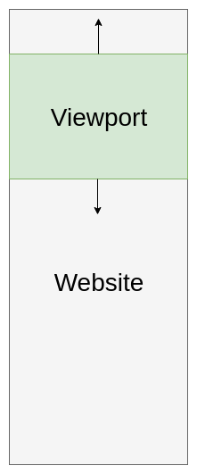
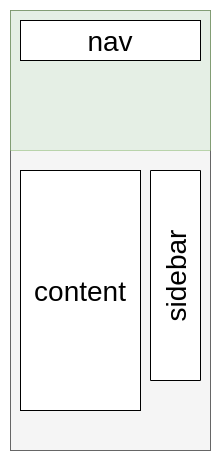
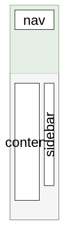
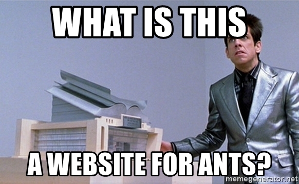
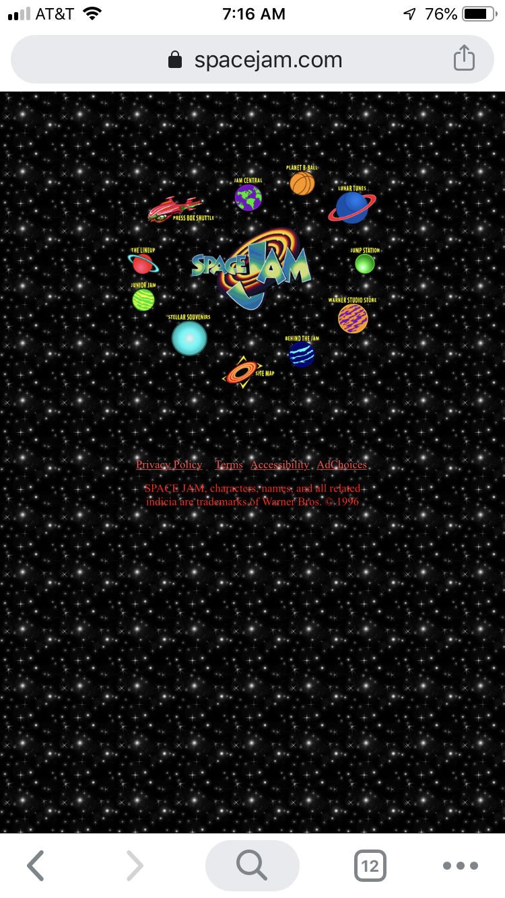

[](https://generalassemb.ly/education/web-development-immersive)

# Responsive Design

The goal of this mini-lesson is to start thinking in a new way about how
websites should be structured. We'll talk about the problems with building fixed width websites and the ways to
avoid them.

On some websites, over 40% of the traffic comes from mobile devices or tablets.
Many people's only connection to the internet is through their smartphone.

Addressing this problem is not just a matter of aesthetics, but functionality
and even more so, accessibility. Catering to everyone who visits your site is
absolutely in your best interest.

## Prerequisites

- HTML
- CSS

## Objectives

By the end of this, developers should be able to:

- Explain the meaning of responsive design and its importance in the industry
- Implement media queries into CSS to make web pages responsive

## The Problem

Websites are often built with a desktop environment in mind. Think about a long
sheet of paper in portrait mode - it's got a specific width, and you scroll up
and down the page.

The part of the site that you can see at any given time is what's inside the
`viewport`. It's just like it sounds. You can think of the viewport as the
window to the site - the whole site is there, but you can only look at a little
bit at a time.



Building websites for a desktop environment means, generally, you're operating
with a minimum width of 900 pixels. It also means the content inside that 900px
is either:

- A percentage of the width (e.g. 50%)
- A fixed width (e.g. 450px)

Here's a basic example of a site with a sidebar:



Let's think about what might happen when we look at this page on a smaller
screen, like a phone or tablet. Or for something comparable, imagine what it
would happen if you took your web browser and dragged/resized it to make it
skinnier.



### Best Case Scenario

The phone will render the page with all of its features at normal proportions,
just super zoomed out. If you've ever used a website like this you understand
the frustrations - horizontal scrolling, tiny text, everything looks like it's
made for ants.



Here's a screenshot of the Space Jam website, which is obviously a website that you would visit on a regular basis. ANTS!



### Worst Case Scenario

The worst case scenario is like the squished image above. All of the content
formatting is basically unreadable because it's still 1/3 of the screen, but the
screen is way smaller now.

## I Do: Implementing Responsive Design

Let's start by examining [this codebase](https://git.generalassemb.ly/sei-embers/responsive-web-design-starter-code) for a basic web page layout. What do you notice about the widths of the different elements? What does the site look like when we change the view?

> To see what your web page will look like on different devices, go to your DevTools in Chrome and 
> click on the tablet/phone icon at the top left. From there, you can select different devices from the 
> navbar that appears in your browser.

## Bad Solution

In the olden days, some websites had two versions: desktop and mobile.

You may even still see sites that do this. Visiting `https://www.reddit.com`
from your desktop works great, but when you would visit it from your phone and you'd 
be redirected to `https://m.reddit.com`.

These were totally different sites! Different HTML, CSS, and JavaScript being
served to the same users, just because they logged in from their phone.

THIS IS TERRIBLE! Now you (the developer) have to maintain two completely
different websites. Both versions - and you - are all probably both going to
suffer as a result.

## Good Solution: Introducing Media Queries

Media queries are a CSS feature that allows you define properties and values at
different browser widths.

Here's what a media query looks like in its simplest form:

```css
@media screen and (max-width: 500px) {
  width: 100%;
}
```

Let's break it down:

- `@media` is the start of the declaration. Required.
- `screen` tells the browser to only use this on the screen. Another option is
  `print` for pdfs or printing out HTML pages. Optional.
- `(max-width: 500px)` is one of the parameters you can specify. There are lots.
  This tells the screen to only apply this query when the screen width is BELOW
  500px. Required.

> For reference:
> https://developer.mozilla.org/en-US/docs/Web/CSS/Media_Queries/Using_media_queries

## Breakpoints

Breakpoints are just a set of (usually 3-5) viewport widths, that you use in
conjunction with media queries.

The idea is that you want your website to react predictably. Therefore, you should decide when
you want your media queries to do their magic, and stick to that same set.

Here's what [bootstrap](https://getbootstrap.com/docs/4.1/layout/overview/), the
most popular CSS framework uses:

```css
/* Small devices (landscape phones, 576px and up) */
@media screen and (min-width: 576px) {
  ...;
}

/* Medium devices (tablets, 768px and up) */
@media screen and (min-width: 768px) {
  ...;
}

/* Large devices (desktops, 992px and up) */
@media screen and (min-width: 992px) {
  ...;
}

/* Extra large devices (large desktops, 1200px and up) */
@media screen and (min-width: 1200px) {
  ...;
}
```

You're not tied to using only these specific widths, but keep them for the sake
of this exercise. As you can see above, Boostrap uses `min-width` instead of `max-width`. 
This simply means that the declarations in these media queries will apply to screens of 
this pixel size and __above__ instead of __below__. It can go either way! You can even 
combine these statements to apply styles between a range of screen sizes.

> Related:
> [here's a really good article](https://medium.freecodecamp.org/the-100-correct-way-to-do-css-breakpoints-88d6a5ba1862)
> on how you should choose your breakpoints

## Let's Use All This Stuff Now

We'll use these media queries and breakpoints together to make sure that our
website looks nice on all sized devices! Let's make some changes to the starter code to make our site responsive.

The first thing we should do is get a sense of all the different components that
we want to affect using media queries.

In this case, we'll start with the `.text` and `.sidebar` classes, because as we
saw before, they have fixed widths and are full of content that gets squished on
small screen sizes.

Since we've decided on our breakpoints above, let's write a media query and
create a new class. We'll put this new class on whatever elements we want to
change with the media query.

We could also just modify the classes we already have by wrapping them in media
queries, but that's less flexible, and way more repetitive.

> Note: we're using max-width here instead of the min-width examples that
> Bootstrap has.

```css
@media screen and (max-width: 576px) {
  .small-100 {
    width: 100%;
  }
}
```

Let's add that class to the appropriate elements and resize the window. WHAT IS HAPPENING??! The sidebar should pop down below the text content when the viewport width gets
smaller than 576px.

Now let's add more media queries at different widths and use them to create different classes!

## What Else Can We Do With Media Queries?

Obviously, width isn't the only property we can change using a media query. We
can change **any** css property.

We'll add a new class to the small media query called `hidden-small`

```css
@media screen and (max-width: 576px) {
  .small-100 {
    width: 100%;
  }
  .hidden-small {
    display: none;
  }
}
```

Now we will apply that class to a couple of the `.navbar-item` elements, and watch
them disappear when you shrink your browser window.

**AMAZING!!!**

You can also do this in reverse - hiding stuff on large screens and only showing
on mobile. Think about the hamburger menu that appears on mobile navbars.

## Thinking Responsively

When planning your site, don't think about a piece of paper on a desk with stuff
drawn on it. That's a fixed layout! Instead, think in components and think about
how those components will look on different devices.

Start from the mobile layout and scale up when designing your page. Most CSS
frameworks are mobile-first - since mobile is a huge portion of web traffic - and it's
easier to scale up and add items than cram stuff into a small space.

It's 2021. We don't build non-responsive websites anymore!

## Additional Resources

- [A list of device viewport sizes](http://viewportsizes.com/)
- [Solution branch for the starter code](https://git.generalassemb.ly/sei-buffleheads/responsive-web-design-starter-code/tree/solution-responsive). You can also fork and clone [the exercise repo](https://git.generalassemb.ly/sei-buffleheads/responsive-web-design-starter-code) and run `git checkout solution-responsive` in your terminal to examine the codebase on your local machine.

## [License](LICENSE)

1. All content is licensed under a CC­BY­NC­SA 4.0 license.
1. All software code is licensed under GNU GPLv3. For commercial use or
   alternative licensing, please contact legal@ga.co.
