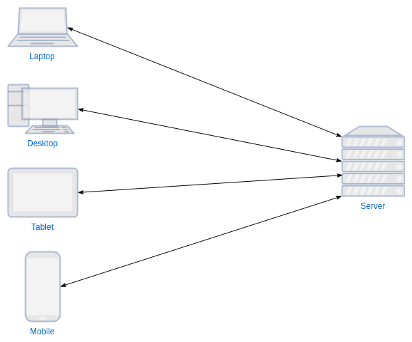

[](https://generalassemb.ly/education/web-development-immersive)

# Intro to Node and NPM

Learn about server-side JavaScript with Node and NPM.

## Objectives

By the end of this, developers should be able to:

- Understand the difference between server-side and client-side JavaScript
- Import and export Node modules
- Use npm to install and manage local and global dependencies
- Use Node to work with the file system
- Publish an npm module to the npm registry

## Introduction

Today, we're going to embark on the next leg of our journey in learning full-stack web development: the back-end.
If we're writing JavaScript for a website but it's not being run in the browser, then where is it running?

## The Role of the Server

In web development, the most common job of a _server_ is to **respond** to _client_ **requests**. 
If a server application receives a request it can't fulfill, it still provides a response.
If a server doesn't respond with anything, we'll assume that it is down or that something has gone wrong with our connection.



There is a 'contract' between servers and clients where a _client makes requests to a server_ and the _server responds to the request_.
This is a paradigm known as [request-response](https://en.wikipedia.org/wiki/Request%E2%80%93response).
The rules laid down by this paradigm enforce a standard baseline for a reliable internet we've all come to enjoy.

In a practical sense, every time you visit a website (like `http://google.com`) you're seeing what's been requested and returned from a server.

So far, all our web applications have run entirely in the browser. 
We did deploy them, so users could use our applications from anywhere. 
Very, very few applications work like that in the real world.

So how do we make applications in such a way that different users can interact with each other through them from different clients?

We use a server!

## What is Node?

Node is a server-side runtime of JavaScript.

What does that mean? To answer that, we have to rethink our understanding of JavaScript.

Most programming languages have different versions of the language. 
As new features are rolled out, they are released in a new version of the language.
JavaScript has this as well, but is unique in that JavaScript is run in multiple different environments.
So there isn't just one "JavaScript", there are many.

The implementations of JavaScript are different in different browsers, i.e. the
language is different in Chrome, Firefox, Internet Explorer, etc. Each
implementation follows the same specification, which is maintained and updated
by a central committee called TC39, but each vendor is in charge of their own
implementation.

[Node](https://nodejs.org/), then, is just another implementation of the JavaScript specification.

What's important about Node, though, and what makes it a little different from
the browser implementations, is that it is aimed at running JavaScript in a
server environment, not a browser!

That means there are some practical differences in how we write JavaScript in Node versus for a browser.
It also means there is a lot of server specific functionality that will only work in Node. 
For example, `console.log(this)` in Node and in the browser will give different results.

## Your First Node Application

We're going to explore working with Node and npm in our `sandbox` directory.

### Instructions

1. Navigate to your `sandbox`
1. Create a new directory called `hello-node` and `cd` into it.
1. Create a file called `index.js` and edit it in your text editor.
1. Console log 'hello world'.
1. Create an array with at least three items, assign it to a variable, and
   console log it.
1. Create an object with at least two properties, assign it to a variable, and
   console log it.
1. Write a DOM method like `document.querySelector()` and see what happens.
1. In your command line and enter the command `node index.js`. Make sure you're
   in the same directory as the file you're trying to run.

**Review Questions:**

- What does the `node` command do?
- What happens with `document`? Can we fix that?
- What if you type `node` just by itself?

## Working with Modules and Dependencies

We use npm and the `package.json` file it creates to manage our project. 
Most importantly, we use it to manage **project dependencies.**

Dependencies are modules or libraries of code, separate from our application,
that our application relies on in order to function.
It's a way for us to reuse code, either written by ourselves or someone else.

The `package.json` file is used to describe details about our project - one of
those details is the project's dependencies.
They're stored in a key in the file called `dependencies`!

Here's what a typical `package.json` dependency might look like for a medium-sized project:

```json
"dependencies": {
  "bcrypt-nodejs": "0.0.3",
  "body-parser": "^1.18.2",
  "connect-flash": "^0.1.1",
  "cookie-parser": "^1.4.3",
  "express": "^4.16.2",
  "hbs": "^4.0.1",
  "method-override": "^2.3.10",
  "mongoose": "^5.0.7",
  "passport": "^0.4.0"
}
```

### Aside: node_modules and .gitignore

Let's say we want to work on someone else's project. We clone it down to our
computer, and then open it up and start exploring the file structure. You've
already done this with the first JS checkpoint.

It's got various javascript files, and also a `package.json` file describing all
the modules needed to run the code.

Since `package.json` is a list of all of our dependencies, where do those files
all actually live? In the `node_modules` folder. Wait - there's no
`node_modules` folder!

In order to **install** all of the dependencies, we run the command
`npm install` in the directory we cloned down. This command goes to the npm
server and downloads a bunch of javascript files and puts them into the
`node_modules` folder.

Since we have a list of dependencies in the `package.json` file, and anyone that
clones a project down can simply download all the dependencies, we don't want to
include them in our git history. This is where the `.gitignore` comes in.

### Instructions

> Still in your `hello-node` directory

1. In the command line, in your project directory, run:

```sh
npm install lodash
```

Note what happened. A folder called `node_modules` appeared!

Note what didn't happen - there's no `package.json` file. What do we need to do
to make that appear?

```sh
npm init
```

It should already have a dependency of `lodash` in it, from the previous
`npm install lodash` command.

We don't want git to track all the node modules files. There are way too many
and it bloats the size of our project.

Let's set up a new git project in this directory.

```sh
git init
```

2. Create a file called `.gitignore` in the root of your project directory.

   > `touch .gitignore`

3. Open `.gitignore` and type `node_modules` into it.

4. You're done!

You can put the names of any files or folders in the `.gitignore` file. They
will all be ignored. They won't be deleted from git though - you must use
`git rm` for that. For example, if you previously committed a `node_modules`
folder, adding it to `.gitignore` doesn't delete the folder. It simply stops
paying attention to it.

5. In `index.js`:

```js
const _ = require("lodash");

const variousBrownBears = [
  "Atlas bear",
  "Bergman's bear",
  "Blue bear",
  "Eurasian brown bear",
  "European brown bear",
  "Gobi bear",
  "Grizzly bear",
  "Himalayan brown bear",
  "Ussuri brown bear",
  "Kamchatka brown bear",
  "Kodiak bear",
  "Marsican brown bear (critically endangered)",
  "Mexican grizzly bear",
  "East Siberian brown bear",
  "Syrian brown bear"
];

const randomBear = _.sample(variousBrownBears);
console.log(randomBear);
```

6. Next, let's create a new file called `bears.js` and add the array of brown
   bears, removing it from `index.js`.

Add the following to `bears.js`:

```js
module.exports = variousBrownBears;
```

4. Then, in `index.js` add the following:

```js
const variousBrownBears = require("./bears");
```

5. Run `node index.js` from the command-line.

**Review Questions:**

- In your own words, describe what we just did

## Working With the File System

One of the key advantages to working on the server is being able to work with
the file system. Working with the file systems is especially handy if we're
using Node to build command line applications, which we can do because Node is
not confined to the browser!

Node comes with a module, called
[fs](https://nodejs.org/dist/latest-v10.x/docs/api/fs.html), for working with
the file system.

### Set up

1. Create a new folder in your `sandbox` directory, call it `node-fs`
1. `cd` into `node-fs` and create a file called `index.js`

### Write to a file

We'll start by exploring how to create (i.e. write) files using Node. The method
for doing so is part of the `fs` module and is called `writeFile`.

> Documentation for
> [fs.writeFile](https://nodejs.org/api/fs.html#fs_fs_writefile_file_data_options_callback)

Update your `index.js` file with this code snippet:

```js
let fs = require("fs")

fs.writeFile("./file.txt", "hello world", 
  error=> {
    if (error) console.error(error) 
    else console.log("Success!") 
  }
)
```

Let's break this down:

1. We first import `fs`, and save it to a variable using `require()`.
1. The first argument is the path and name of the file we want to write.
1. The second argument is the data we want to write. In this case, just a string that says `hello world`.
1. The last argument is a `callback` function, or a function that runs when the writing is complete.

Go ahead and run this file in your terminal by typing `node index.js`.

### Read From a File

So, we've written some data to a file. How can we get the contents of it?

Comment out the code to for `writeFile` and add the following below:

```js

fs.readFile("./file.txt", "utf8", 
  (error, data)=> {
    if (error) console.error(error)
    else console.log("Success: ", data)
  }
)
```

This looks very similar to the `writefile` syntax, but with some different
arguments:

1. Argument 1 is the path to the file we want to read
1. Argument 2 is the `encoding` of the file. If you don't specify the encoding,
   what happens?
1. Argument 3 is the callback function again. It takes two arguments: `error`
   and `data`.

This is great and all, but can't we do more than hello world? Why yes, yes we
can.

### Parsing & Stringifying JSON

Enter JSON: [JavaScript Object Notation](https://en.wikipedia.org/wiki/JSON).
It's a format that looks very similar to JavaScript objects, so it's easy to
read and write by hand (if we want to).

Let's create a plain old JavaScript object in our `index.js` file:

```js
const pojo = {
  animal: false,
  name: "peter obvarious jones otlewski",
  password: "shenanigan174",
  hobbies: ["reading", "writing", "snowboarding", "cat petting"]
};
```

Now we have a nice regular JavaScript object. Let's turn it into a JSON string:

```js
const pojoJson = JSON.stringify(pojo);
```

If we console log `pojoJson` we will see something like this:

```js
{"animal": false,"name": "peter obvarious jones otlewski","password": "shenanigan174","hobbies": ["reading", "writing", "snowboarding", "cat petting"]}
```

Now we can take this and write it into the file.

Comment out the `readfile` function and uncomment the `writefile`. Move it below
the object declaration. Then, swap out `'hello world'` with the `pojoJson`
variable.

Now your whole file should look something like this:

```js
const fs = require("fs")

const pojo = {
  animal: false,
  name: "peter obvarious jones otlewski",
  password: "shenanigan174",
  hobbies: ["reading", "writing", "snowboarding", "cat petting"]
}

const pojoJson = JSON.stringify(pojo)

fs.writeFile("./file.txt", pojoJson, error => {
  /** another way to log the error message */
    if (error) throw error
    console.log("done")
})
```

Run the script again in your terminal, and check the results in `file.txt`. What
happens if you don't stringify it first? Try just writing the `pojo` object to
the file and then look at it.

## Lab: [Build Your Own Node Module](https://git.generalassemb.ly/sei-embers/npm-resume)

Let's build off of our work with `fs` and JSON and build out your resume as a
node module and publish it to the npm registry! 
Work through [this repository](https://git.generalassemb.ly/sei-embers/npm-resume).

## Additional Resources

- [Node.js Documentation](https://nodejs.org/en/)
- [Rising Stack](https://blog.risingstack.com/) - A really great resource for
  Node

## [License](LICENSE)

1. All content is licensed under a CC­BY­NC­SA 4.0 license.
1. All software code is licensed under GNU GPLv3. For commercial use or
   alternative licensing, please contact legal@ga.co.
